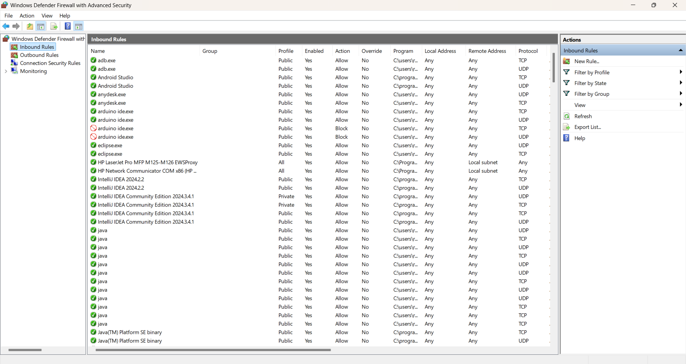
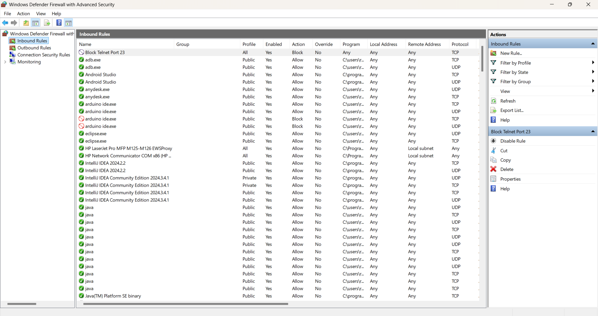
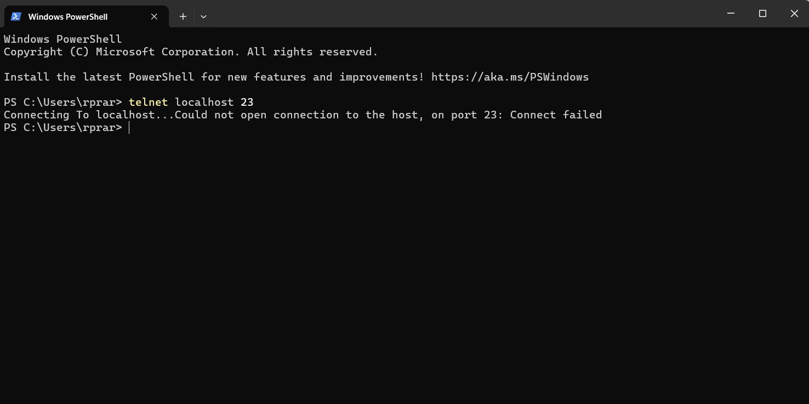

# firewall

**Task 4: Setup and Use a Firewall on Windows 11
Objective: To configure and test basic firewall rules to allow or block network traffic on a Windows 11 system.**

**Step-by-Step Process**

_**1) Opening the Windows Firewall Configuration Tool**_

Press Win + R, type wf.msc, and hit Enter.

_**2) Listing Current Firewall Rules**_

existing Inbound Rules.

_**3) Blocking Inbound Traffic on Port 23 (Telnet)**_

configure a rule to block any inbound connections on TCP port 23, commonly used for Telnet:
Choose Inbound Rules → Click New Rule...
Select Port → TCP → Specific local port: 23
Select Block the connection
Apply to Domain, Private, and Public profiles
Name the rule: Block Telnet Port 23

_**4) Testing the Block Rule**_

To verify the block, enable the Telnet client:
Go to Control Panel > Programs > Turn Windows features on or off
Check Telnet Client, click OK.
Then, in the Command Prompt:
telnet localhost 23
As expected, the connection failed with the message:
Could not open connection to the host, on port 23: Connect failed

_**5) Removing the Test Block Rule**_

Once testing is completed, delete the Telnet block rule:
Navigate to Inbound Rules
Right-click on Block Telnet Port 23 → Click Delete

_**Summary: How Firewall Filters Traffic**_

Windows Firewall operates by applying a list of rules to control the flow of network traffic:
Inbound Rules regulate traffic entering the device.
Outbound Rules regulate traffic leaving the device.
Rules can be created based on port number, IP address, protocol (TCP/UDP), or application/program.
Each rule can either Allow, Block, or Prompt the user when a match is found.
